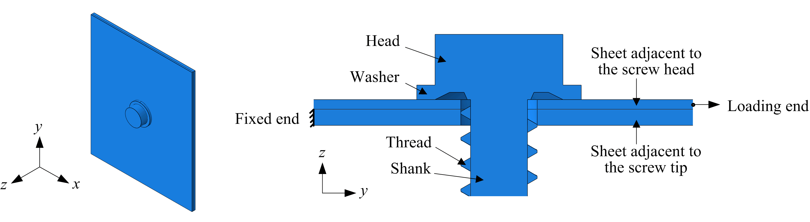

# femssc

Pre- and post-processing scripts for finite element (FE) modeling of self-drilling screw connections between thin steel sheets used in the paper "[Shear deformation behavior and modeling of self-drilling screw connections between thin steel sheets]()"



As a type of widely utilized mechanical fastener responsible for transferring shear forces or tension-shear interactions, self-drilling screw connection plays a prominent role in the overall structural performance of cold-formed steel assembled members and structures. Although the bearing capacity of screw connections has been investigated continually, far less attention has been paid to their deformation behavior. A parameterized FE model of self-drilling screw connections is thus developed by using __femssc__ based on a built-in Python 2.X in Abaqus, to deeply explore the shear deformation behavior of screw connections and to propose a prediction model for quantitatively describe their load versus deformation relationships. Details of this FE model are presented in the related paper.

Kangyi Cai 2021 @ WHU

## Citing

If you use these scripts in your study, please cite the related paper:
```
Cai, K., Yuan, H., Du, X., Li, Z. Shear deformation behavior and modeling of self-drilling screw connections between thin steel sheets. 
```

Or in the format of BibTex:
```
@article{,
  title={Shear deformation behavior and modeling of self-drilling screw connections between thin steel sheets},
  author={Cai, Kangyi, Yuan, Huanxin, Du, Xinxi, and Li, Zhanjie},
  journal={},
  volume={},
  pages={},
  publisher={}
  doi={}
}
```

# Features

## prepp.py

Generate .inp files, namely establish FE models of self-drilling screw connections with different sheet thicknesses and materials, as well as diverse screw diameters and arrangements.

## postp.py

Based on generated .inp files, recreate jobs for computation, and obtain .rpt and .png files, corresponding to curves and contours, respectively.

# Usage

## prepp.py

- Create a folder containing this script

- Determine parameters of the database in this script

- Open Abaqus/CAE

- Set work directory to the folder

- Run this script

## postp.py

- Create a folder containing this script and all the .inp files for computation

- Determine the value of __switchMode__, __copyOrNot__ and __targetDirM__ in this script

- Open Abaqus/CAE

- Set work directory to the folder

- Run this script

# License

MIT