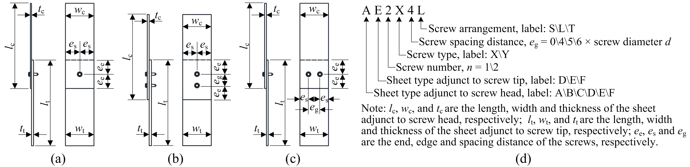
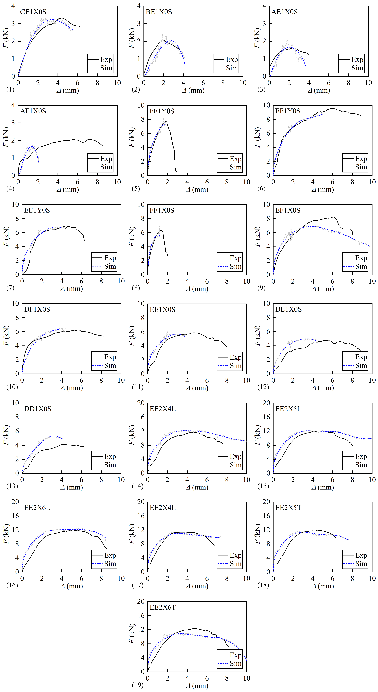
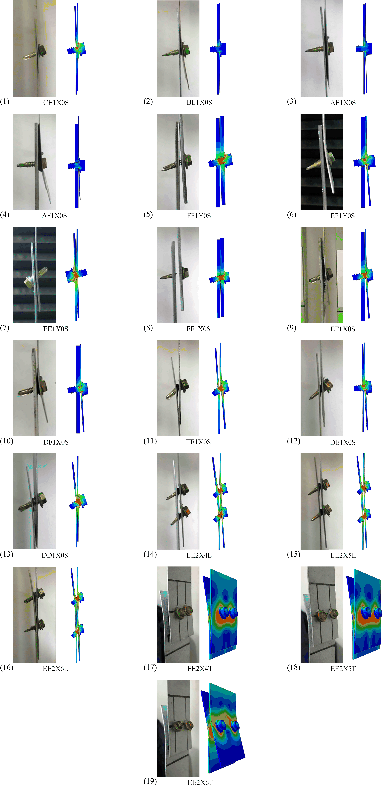

# Specimen characteristics

Specimen configurations: (a) single screw connection (S); (b) longitudinal double screw connection (L); (c) transverse double screw connection (T); (d) labeling convention

| No. | Label | _Grade_c | _t_c(mm) | _w_c(mm) | _l_c(mm) | _Grade_t | _t_t(mm) | _w_t(mm) | _l_t(mm) | _n_ | _d_(mm) | _e_g(*_d_) | _e_e(mm) | _Arrangement_ |
| -- | ------ | ---- | --- | -- | --- | ---- | --- | -- | --- | - | --- | - | -- | - |
|  1 | CE1X0S | S350 | 0.6 | 50 | 300 | S550 | 1.0 | 50 | 300 | 1 | 4.8 | 0 | 30 | S |
|  2 | BE1X0S | S350 | 0.5 | 50 | 300 | S550 | 1.0 | 50 | 300 | 1 | 4.8 | 0 | 30 | S |
|  3 | AE1X0S | S350 | 0.4 | 50 | 300 | S550 | 1.0 | 50 | 300 | 1 | 4.8 | 0 | 30 | S |
|  4 | AF1X0S | S350 | 0.4 | 50 | 300 | S350 | 2.5 | 50 | 300 | 1 | 4.8 | 0 | 30 | S |
|  5 | FF1Y0S | S350 | 2.5 | 50 | 300 | S350 | 2.5 | 50 | 300 | 1 | 5.5 | 0 | 30 | S |
|  6 | EF1Y0S | S550 | 1.0 | 50 | 300 | S350 | 2.5 | 50 | 300 | 1 | 5.5 | 0 | 30 | S |
|  7 | EE1Y0S | S550 | 1.0 | 50 | 300 | S550 | 1.0 | 50 | 300 | 1 | 5.5 | 0 | 30 | S |
|  8 | FF1X0S | S350 | 2.5 | 50 | 300 | S350 | 2.5 | 50 | 300 | 1 | 4.8 | 0 | 30 | S |
|  9 | EF1X0S | S550 | 1.0 | 50 | 300 | S350 | 2.5 | 50 | 300 | 1 | 4.8 | 0 | 30 | S |
| 10 | DF1X0S | S550 | 0.8 | 50 | 300 | S350 | 2.5 | 50 | 300 | 1 | 4.8 | 0 | 30 | S |
| 11 | EE1X0S | S550 | 1.0 | 50 | 300 | S550 | 1.0 | 50 | 300 | 1 | 4.8 | 0 | 30 | S |
| 12 | DE1X0S | S550 | 0.8 | 50 | 300 | S550 | 1.0 | 50 | 300 | 1 | 4.8 | 0 | 30 | S |
| 13 | DD1X0S | S550 | 0.8 | 50 | 300 | S550 | 0.8 | 50 | 300 | 1 | 4.8 | 0 | 30 | S |
| 14 | EE2X4L | S550 | 1.0 | 50 | 300 | S550 | 1.0 | 50 | 300 | 2 | 4.8 | 4 | 30 | L |
| 15 | EE2X5L | S550 | 1.0 | 50 | 300 | S550 | 1.0 | 50 | 300 | 2 | 4.8 | 5 | 30 | L |
| 16 | EE2X6L | S550 | 1.0 | 50 | 300 | S550 | 1.0 | 50 | 300 | 2 | 4.8 | 6 | 30 | L |
| 17 | EE2X4T | S550 | 1.0 | 50 | 300 | S550 | 1.0 | 50 | 300 | 2 | 4.8 | 4 | 30 | T |
| 18 | EE2X5T | S550 | 1.0 | 50 | 300 | S550 | 1.0 | 50 | 300 | 2 | 4.8 | 5 | 30 | T |
| 19 | EE2X6T | S550 | 1.0 | 50 | 300 | S550 | 1.0 | 50 | 300 | 2 | 4.8 | 6 | 30 | T |

# comparison between the simulated and experimental results

## load vresus deformation curves

## failure modes

